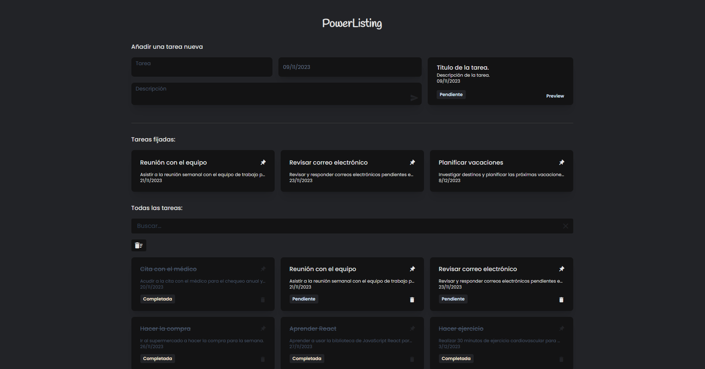

### PowerListing

#### Project Preview

#### Description

PowerListing is a web-based task list application made with React, TypeScript, and Vite. It allows you to create, edit, and delete tasks quickly and easily. You can also filter and sort your tasks by priority, date, or status.

#### Installation

To install PowerListing, you need to have Node.js installed on your machine. Then, follow these steps:

-   Clone this repository to your local directory: `git clone https://github.com/example/PowerListing.git`
-   Run the command `npm install` to install the project dependencies.
-   Run the command `npm run dev` to start the development server.
-   Open your browser and go to the address`http://localhost:3000`.

#### Features

PowerListing offers you the following features:

-   A simple and elegant interface that adapts to any device.
-   An intuitive way to create and manage your tasks with just a few clicks.
-   An option to mark your tasks as completed or pending.
-   An option to assign a deadline and a note to each task.
-   An option to filter and sort your tasks by different criteria.
-   An option to delete all completed tasks at once.

#### Technologies:

PowerListing está hecho con las siguientes tecnologías y librerías:

-   [React](https://reactjs.org/): A JavaScript library for building user interfaces.
-   [Vite](https://vitejs.dev/): A modern and fast web development build tool.
-   [Redux](https://es.redux.js.org/): A JavaScript library for managing application state.
-   [redux-toolkit](https://redux-toolkit.js.org/): A utility library for Redux.
-   [Tailwind CSS](https://tailwindcss.com/): A CSS framework that allos you to create custom designs without leaving HTML.
-   [React Datepicker](https://reactdatepicker.com/): A datepicker library for React.
-   [React Tooltip](https://www.npmjs.com/package/react-tooltip): A tooltip library for React.
-   [AutoAnimate](https://auto-animate.formkit.com/): An animation library for React.
